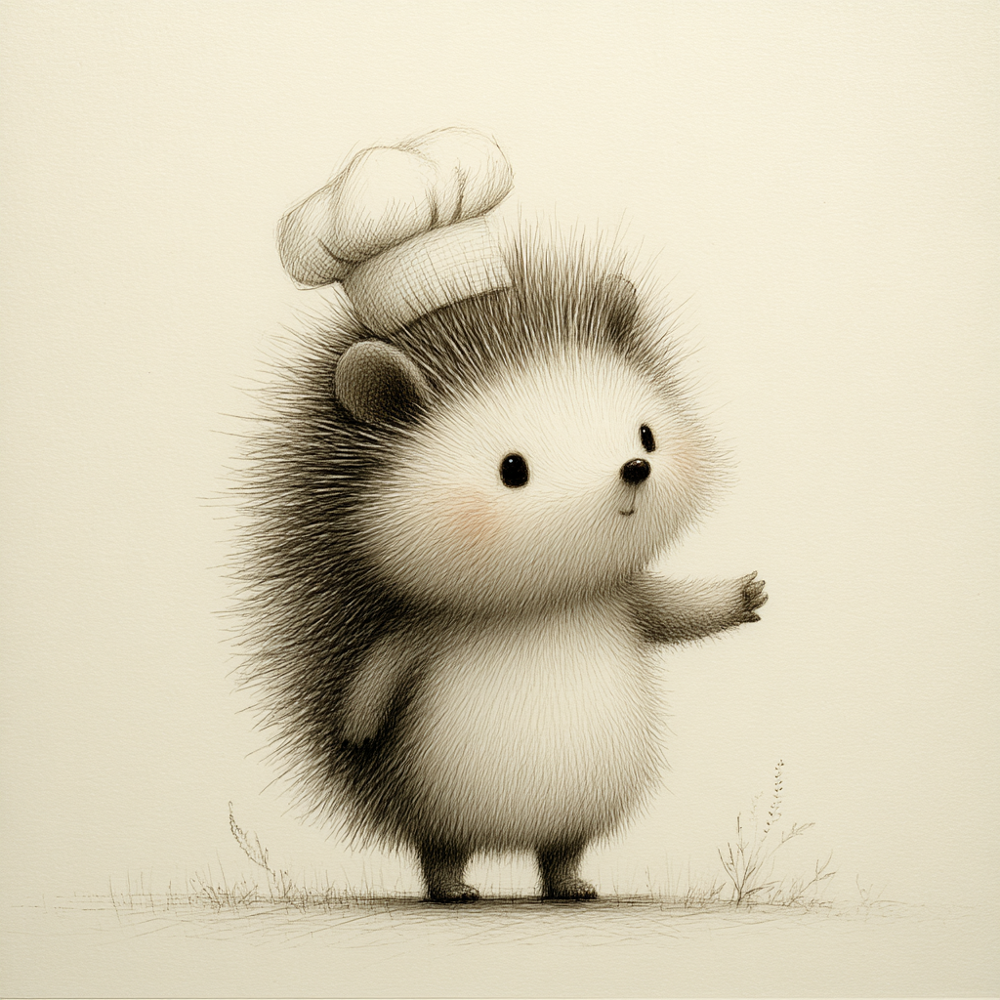
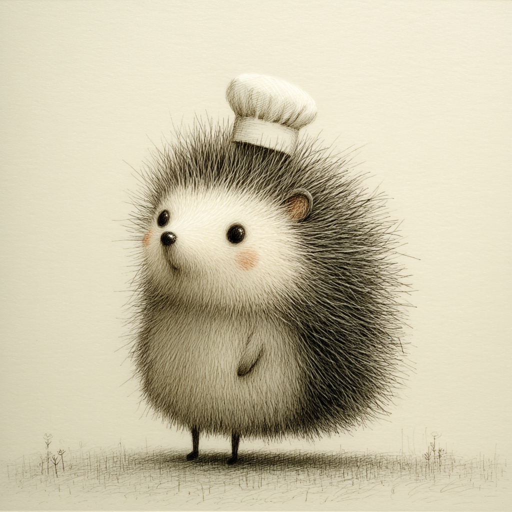
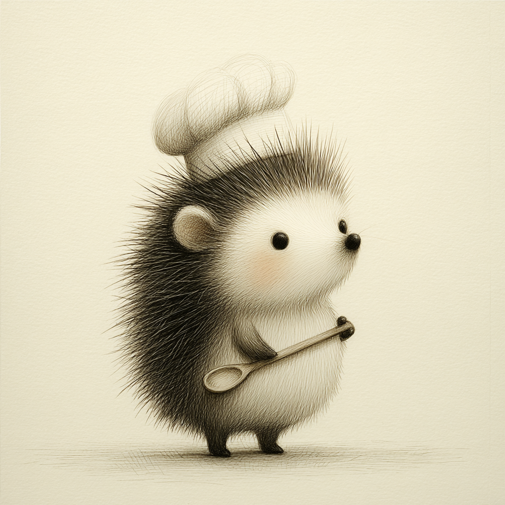
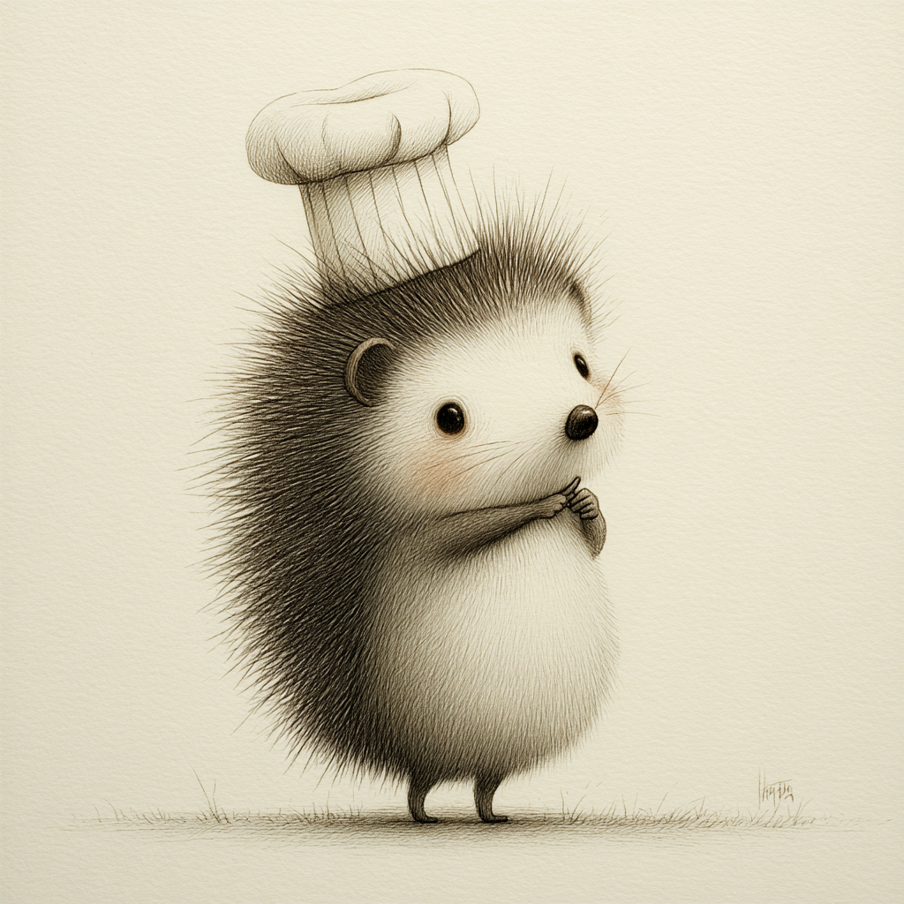
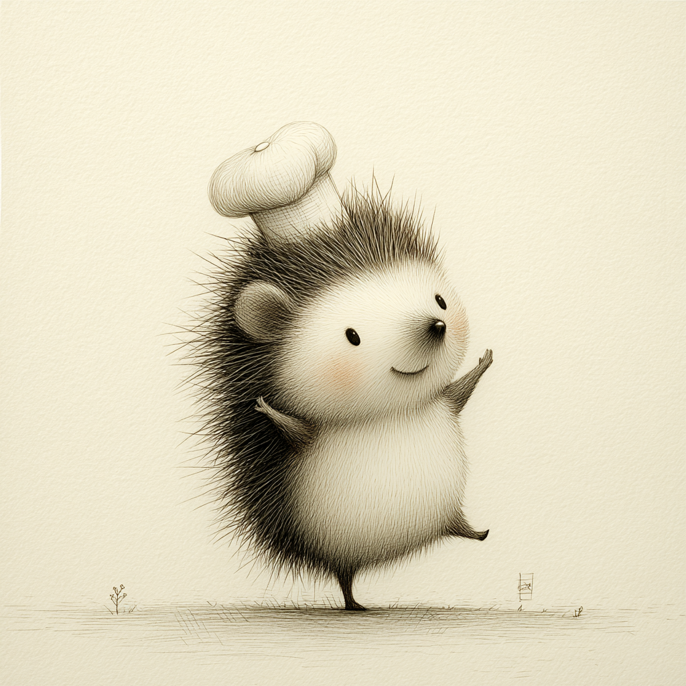
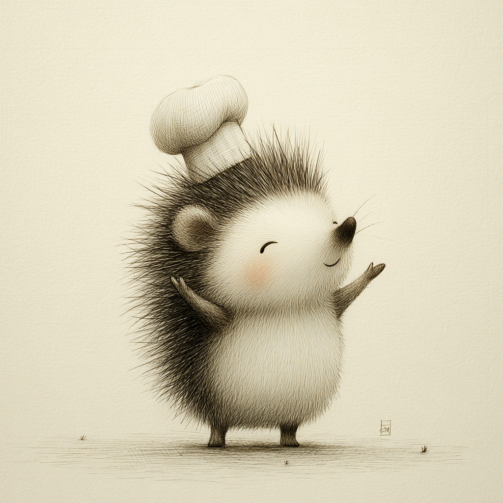

<p align="center">
  
</p>

<h1 align="center">Pip's Kitchen Garden</h1>

<p align="center">
  <strong>A delightful iOS cooking game for kids aged 9-12</strong><br>
  Grow vegetables, cook recipes, and learn about nutrition!
</p>

<p align="center">
  
  
  
  
</p>

---

## Meet Pip

Pip is your friendly hedgehog chef guide! With 6 adorable poses, Pip helps kids through every step of their cooking adventure.

<p align="center">
  
  
  
  
  
  
</p>

<p align="center">
  <em>Neutral • Waving • Cooking • Thinking • Excited • Celebrating</em>
</p>

---

## Game Loop

```
┌─────────────────────────────────────────────────────────┐
│                   PIP'S KITCHEN GARDEN                  │
│                                                         │
│     🌱 GROW          🍳 COOK           🫀 FEED          │
│    ─────────  →    ─────────   →    ─────────          │
│    Garden          Kitchen          Body               │
│    Mini-games      Mini-games       Adventure          │
│                                                         │
│                    🏆 REWARDS                           │
│              Coins, Seeds, XP, Badges                   │
└─────────────────────────────────────────────────────────┘
```

---

## Features

| Feature | Description |
|---------|-------------|
| 🌱 **Garden** | Plant, water, and harvest vegetables with fun gestures |
| 🍳 **Kitchen** | Cook recipes through interactive mini-games (chop, mix, pour, flip!) |
| 🫀 **Body Buddy** | Watch food travel through the digestive system |
| ⭐ **Progression** | Earn coins, XP, badges, and unlock new recipes |
| 🎯 **Quests** | Daily and weekly challenges to keep kids engaged |

---

## Style Guide

### Color Palette

The visual style is inspired by **vintage botanical watercolor illustrations** with a warm, whimsical, handcrafted feel.

#### Primary Colors (Backgrounds)

| Color | Hex | Preview | Usage |
|-------|-----|---------|-------|
| **Cream** | `#F5F0E1` |  | Main backgrounds |
| **Warm Cream** | `#FAF6EB` |  | Lighter backgrounds |
| **Parchment** | `#EDE6D3` |  | Cards, surfaces |

#### Text Colors

| Color | Hex | Preview | Usage |
|-------|-----|---------|-------|
| **Dark Brown** | `#5D4E37` |  | Headlines, emphasis |
| **Sepia** | `#8B7355` |  | Primary text |
| **Light Sepia** | `#A89880` |  | Secondary text |

#### Accent Colors

| Color | Hex | Preview | Usage |
|-------|-----|---------|-------|
| **Golden Wheat** | `#C9A227` |  | Buttons, highlights, rewards |
| **Sage** | `#6B7B5E` |  | Nature accents, success states |
| **Soft Olive** | `#8A9A7B` |  | Secondary accents |
| **Terracotta** | `#B87333` |  | Warnings, heat indicators |

#### Difficulty Level Colors

| Level | Color | Hex | Icon |
|-------|-------|-----|------|
| **Easy** | Soft Olive | `#8A9A7B` | 🌿 `leaf.fill` |
| **Medium** | Golden Wheat | `#C9A227` | 🔥 `flame.fill` |
| **Hard** | Terracotta | `#B87333` | 👥 `person.2.fill` |

---

### Typography

All fonts use **SF Rounded** (system) for a friendly, approachable feel.

| Style | Size | Weight | Usage |
|-------|------|--------|-------|
| **Large Title** | 34pt | Bold | Main screen titles |
| **Title** | 28pt | Semibold | Section headers |
| **Title 2** | 22pt | Semibold | Card titles |
| **Title 3** | 20pt | Medium | Subsection headers |
| **Headline** | 17pt | Semibold | Button text, emphasis |
| **Body** | 17pt | Regular | Main content text |
| **Body Bold** | 17pt | Semibold | Emphasized body text |
| **Callout** | 16pt | Regular | Supporting information |
| **Subheadline** | 15pt | Regular | Secondary information |
| **Footnote** | 13pt | Regular | Small details |
| **Caption** | 12pt | Regular | Labels, badges |

#### Special Styles

| Style | Size | Weight | Usage |
|-------|------|--------|-------|
| **Recipe Step** | 18pt | Medium | Cooking instructions |
| **Ingredient Item** | 16pt | Regular | Ingredient lists |
| **Timer Display** | 48pt | Light | Countdown timers |

---

### Spacing System

Consistent spacing creates visual harmony throughout the app.

| Token | Value | Usage |
|-------|-------|-------|
| `xxs` | 4pt | Tight spacing (icon + label) |
| `xs` | 8pt | Small gaps |
| `sm` | 12pt | Compact spacing |
| `md` | 16pt | Default spacing |
| `lg` | 24pt | Section spacing |
| `xl` | 32pt | Large gaps |
| `xxl` | 48pt | Screen sections |

#### Component Sizing

| Component | Value | Notes |
|-----------|-------|-------|
| **Min Tap Target** | 44pt | Accessibility requirement |
| **Button Height** | 52pt | Kid-friendly tap area |
| **Card Corner Radius** | 16pt | Soft, rounded corners |
| **Icon Size** | 24pt | Standard icons |
| **Large Icon Size** | 48pt | Feature icons |

---

### UI Components

#### Cards
```
┌────────────────────────────────┐
│  ░░░░░░░░░░░░░░░░░░░░░░░░░░░░  │  ← 16pt padding
│  ░                          ░  │
│  ░       Card Content       ░  │  ← Parchment background (#EDE6D3)
│  ░                          ░  │
│  ░░░░░░░░░░░░░░░░░░░░░░░░░░░░  │  ← 16pt corner radius
└────────────────────────────────┘    ← Soft shadow (8pt blur)
```

#### Buttons

| Type | Background | Text Color | Border |
|------|------------|------------|--------|
| **Primary** | Golden Wheat `#C9A227` | Cream `#F5F0E1` | None |
| **Secondary** | Parchment `#EDE6D3` | Dark Brown `#5D4E37` | Sepia 30% opacity |

---

### Animation Guidelines

| Animation | Timing | Easing |
|-----------|--------|--------|
| **Bouncy interactions** | 0.5s | `spring(response: 0.5, dampingFraction: 0.6)` |
| **UI appearing** | 0.3s | `easeOut` |
| **UI disappearing** | 0.2s | `easeIn` |
| **Button press** | 0.15s | `easeInOut` (scale to 0.97) |

---

### AI Image Generation (Leonardo.ai)

Use these prompts with **Leonardo.ai** to generate images matching Pip's style.

#### Leonardo Settings

| Setting | Value |
|---------|-------|
| **Model** | Leonardo Phoenix |
| **Alchemy** | ON |
| **Style Reference** | Upload Pip image (pip_neutral or pip_waving) |
| **Style Strength** | 0.75 - 0.80 |

#### Negative Prompt (use for all)
```
realistic, 3d, photograph, dark, scary, detailed, complex, medical diagram, red blood
```

#### Base Style Prompt
Add this to all prompts for consistency:
```
soft pencil sketch on cream paper, children's book illustration,
gentle sepia shading, whimsical friendly character, hand-drawn feel,
minimal details, cozy warm tones, subtle pink blush accents
```

#### Body Buddy Organ Prompts

**Stomach:**
```
cute friendly cartoon stomach character, soft pencil sketch on cream paper,
children's book illustration, gentle sepia shading, whimsical happy face,
hand-drawn feel, minimal details, warm cozy style
```

**Heart:**
```
adorable cartoon heart organ with friendly face, soft pencil sketch,
cream paper background, gentle sepia and pink tones, children's book style,
whimsical character, hand-drawn minimal illustration
```

**Brain:**
```
cute friendly cartoon brain character, soft pencil sketch on cream paper,
gentle sepia shading, children's educational illustration, whimsical face,
hand-drawn cozy style, minimal simple details
```

**Intestines:**
```
friendly cartoon intestines character, cute happy face, soft pencil sketch,
cream paper background, sepia tones, children's book illustration style,
whimsical minimal hand-drawn
```

**Lungs:**
```
adorable cartoon lungs pair with friendly faces, soft pencil sketch,
cream background, gentle sepia shading, children's book whimsical style,
hand-drawn minimal cozy illustration
```

---

## Tech Stack

- **Language:** Swift 5.9
- **UI Framework:** SwiftUI
- **Architecture:** MVVM with ObservableObject
- **Persistence:** UserDefaults (MVP) / Core Data (full version)
- **Minimum iOS:** 16.0
- **Target Devices:** iPhone & iPad

---

## Project Structure

```
ChefAcademy/
├── ChefAcademyApp.swift      # App entry point
├── ContentView.swift         # Main navigation
├── GameState.swift           # Central game state manager
│
├── Views/
│   ├── OnboardingView.swift      # Welcome flow
│   ├── MeetPipViews.swift        # Meet Pip dialogue
│   ├── AvatarCreatorView.swift   # Body Buddy creator
│   ├── GardenView.swift          # Garden gameplay
│   ├── PlotView.swift            # Individual garden plots
│   └── ChopMiniGame.swift        # Chopping mini-game
│
├── Components/
│   ├── PipAnimations.swift       # Pip character poses
│   ├── BackgroundView.swift      # Scenic backgrounds
│   └── VideoPlayerView.swift     # Video playback
│
├── Theme/
│   ├── AppTheme.swift            # Colors, fonts, spacing
│   └── AdaptiveLayout.swift      # Device adaptations
│
└── Assets.xcassets/
    ├── Pip/                      # Character images
    ├── Backgrounds/              # Scene backgrounds
    └── AppIcon.appiconset/       # App icons
```

---

## Getting Started

1. Clone the repository
   ```bash
   git clone https://github.com/GEM-312/ChefAcademy.git
   ```

2. Open in Xcode
   ```bash
   cd ChefAcademy
   open ChefAcademy.xcodeproj
   ```

3. Build and run on simulator or device (iOS 16.0+)

---

## Credits

**Developer:** Marina Pollak
**Course:** PROG-360A Project Studio, Columbia College Chicago
**Instructor:** Janell Baxter

**Nutrition Research:**
- Jessie Inchauspé ("Glucose Goddess")
- *Glucose Revolution* (2022)
- *The Glucose Goddess Method* (2023)

---

<p align="center">
  
  <br>
  <strong>Happy Cooking!</strong>
</p>
